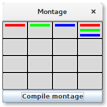

# Advanced Montage
An ImageJ 1.x plugin for creating a montage from a multi-channel image.

## Usage
Start the plugin from the menu at *Plugins > BIC > Montage*. In the *Montage* window that opens up, you can reorder tiles via drag and drop. Right clicking on a position in the grid opens a dialog in which you can edit the content of a tile. If multiple channels are selected, a composite view is generated at the location of the tile. Resizing the *Montage* window will change the number of elements in each row and column respectively. Once you are done with the configuration of the montage, click the *Compile montage* to create a new window with the configured tiles.

